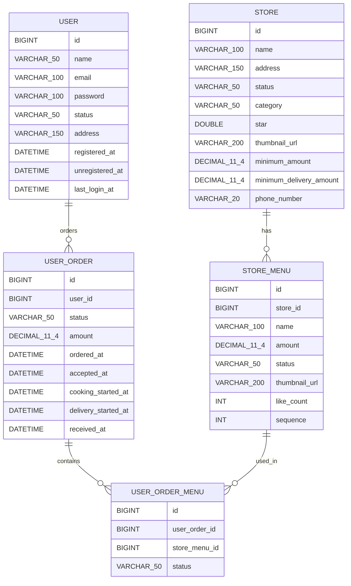

# service

```mermaid
erDiagram
    USER {
        BIGINT id
        VARCHAR_50 name
        VARCHAR_100 email
        VARCHAR_100 password
        VARCHAR_50 status
        VARCHAR_150 address
        DATETIME registered_at
        DATETIME unregistered_at
        DATETIME last_login_at
    }

    STORE {
        BIGINT id
        VARCHAR_100 name
        VARCHAR_150 address
        VARCHAR_50 status
        VARCHAR_50 category
        DOUBLE star
        VARCHAR_200 thumbnail_url
        DECIMAL_11_4 minimum_amount
        DECIMAL_11_4 minimum_delivery_amount
        VARCHAR_20 phone_number
    }

    STORE_MENU {
        BIGINT id
        BIGINT store_id
        VARCHAR_100 name
        DECIMAL_11_4 amount
        VARCHAR_50 status
        VARCHAR_200 thumbnail_url
        INT like_count
        INT sequence
    }

    USER_ORDER {
        BIGINT id
        BIGINT user_id
        VARCHAR_50 status
        DECIMAL_11_4 amount
        DATETIME ordered_at
        DATETIME accepted_at
        DATETIME cooking_started_at
        DATETIME delivery_started_at
        DATETIME received_at
    }

    USER_ORDER_MENU {
        BIGINT id
        BIGINT user_order_id
        BIGINT store_menu_id
        VARCHAR_50 status
    }

    %% 관계 정의
    STORE ||--o{ STORE_MENU : has
    USER ||--o{ USER_ORDER : orders
    USER_ORDER ||--o{ USER_ORDER_MENU : contains
    STORE_MENU ||--o{ USER_ORDER_MENU : used_in
```
